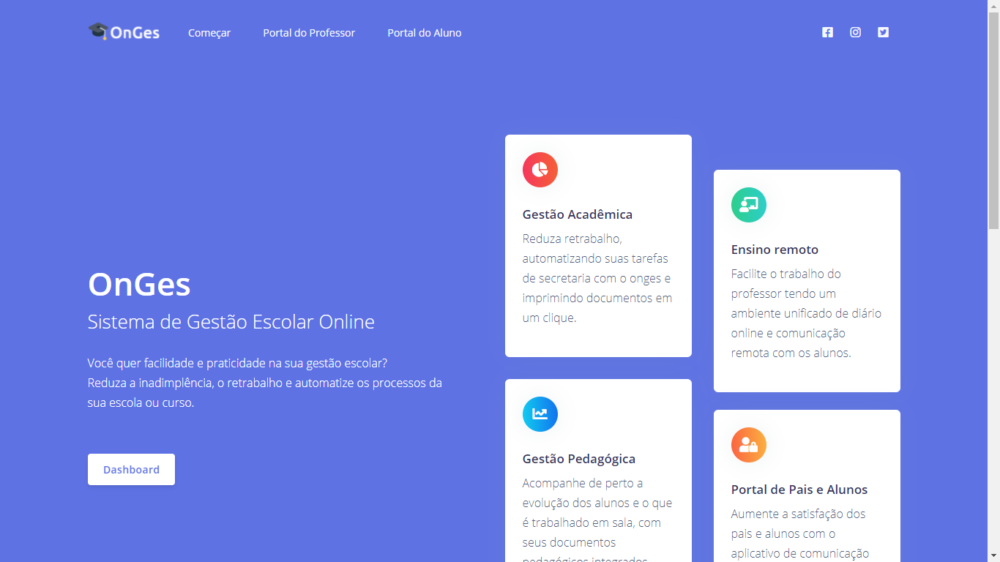
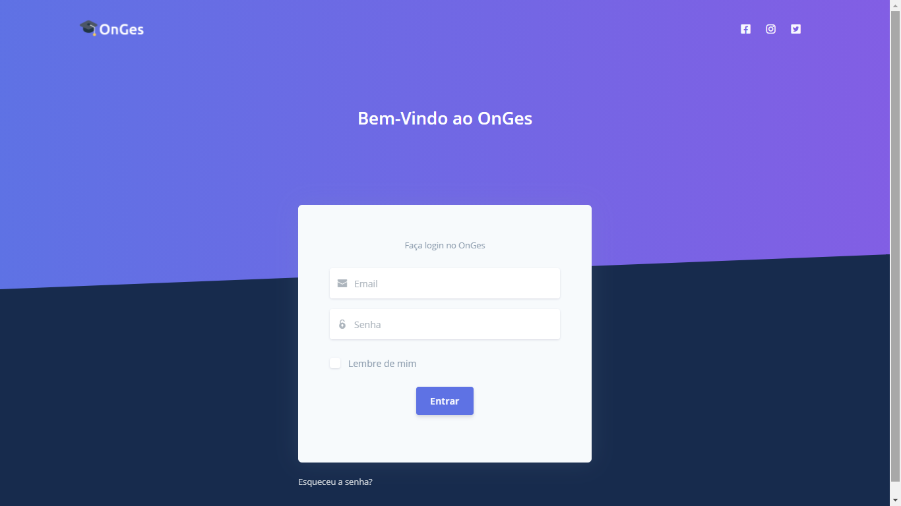
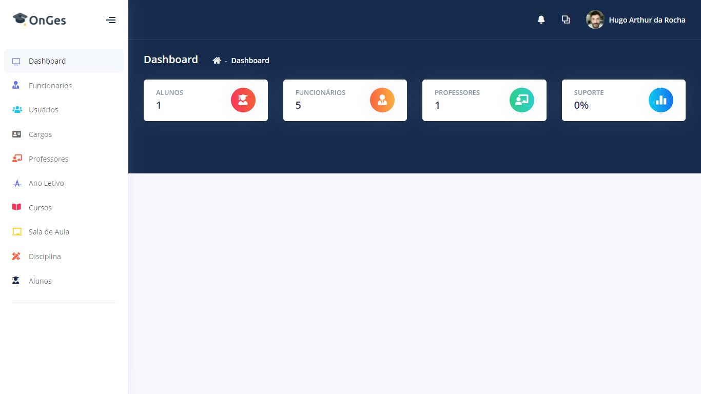
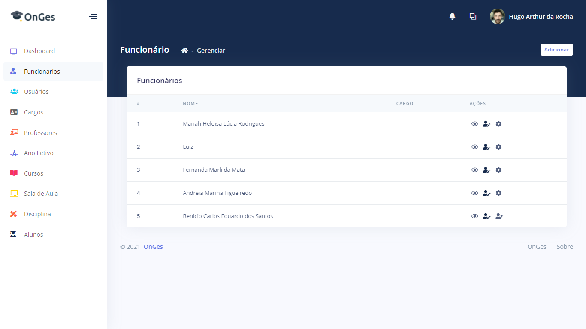
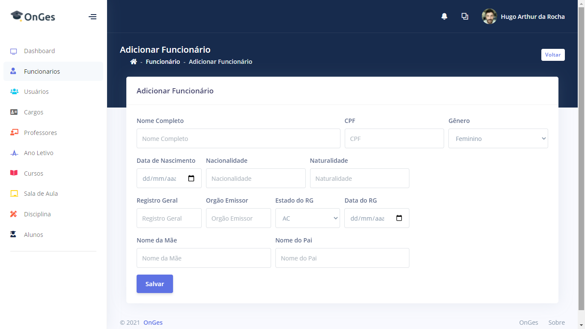
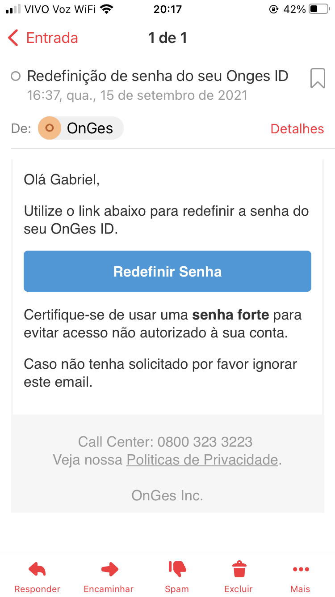

# OnGes - Sistema de Gestão Escolar Online(Desenvolvimento)

Ambiente Teste - http://onges.com.br:8080/

Usuario: 
 
Perfil Diretor: 
Email: hugo.rocha@yopmail.com 
Senha: Teste@123 

### Funções:

- Cadastro: 
    Cargos; 
    Cursos; 
    Ano Letivo; 
    Disciplinas; 
    Funcionarios; 
    Professores; 
    Alunos; 

- Todos os topicos do cadastro é possivel realizar a edição e visualização dos dados.
- Em funcionarios é possivel realizar o cadastro do funcionario que acessa ou não o sistema, esta situação é definida sendo possivel realizar o cadastro usuario para acesso ao sistema.
- Em cargos é possivel definir o que o funcionario vai poder acessar no sistema.
- Ao realizar o cadastro de um novo usuario do sistema, irar chegar um email para o usuario confirar o seu cadastro no sistema, tambem se aplica para o cadastro de professores e alunos.
- E muito mais...

### Portal do Professor e Aluno (Em desenvolvimento)!

## Ferramentas:

Ferramentas utilizadas para desenvolvimento:

<ul>
<li>Java 8</li>
<li>Java Web</li>
<li>Bootstrap</li>
<li>NetBeans IDE</li>
<li>Architect - Para modelagem do banco de dados</li>
<li>Banco de dados: PostgreSQL 13</li>

# Telas do sistema:
    
## Tela inicial

    
## Tela login

## Dashboard

    
## Lista de funcionario

    
## Cadastrar funcionario

    
## Visualizar dados os Funcionarios

    
## Tela de Email Redefinição de Senha

